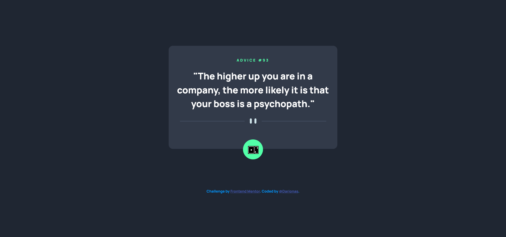

# Frontend Mentor - Advice generator app solution

This is a solution to the [Advice generator app challenge on Frontend Mentor](https://www.frontendmentor.io/challenges/advice-generator-app-QdUG-13db).

## Table of contents

- [Overview](#overview)
  - [The challenge](#the-challenge)
  - [Screenshot](#screenshot)
  - [Links](#links)
- [My process](#my-process)
  - [Built with](#built-with)
  - [What I learned](#what-i-learned)
  - [Continued development](#continued-development)
  - [Useful resources](#useful-resources)
- [Author](#author)
- [Acknowledgments](#acknowledgments)

## Overview

### The challenge

Users should be able to:

- View the optimal layout for the app depending on their device's screen size
- See hover states for all interactive elements on the page
- Generate a new piece of advice by clicking the dice icon

### Screenshot

### Links

- Solution URL: [Advice generator app](https://github.com/Darionas/advice_generator_app)
- Live Site URL: [Advice generator app](https://darionas.github.io/advice_generator_app/)

## My process

* Create drawing from design (structure of design)
 * Create repo
 * Create HTML layout
 * Create CSS layout according style guides
 * Create CSS (grid) layout for mobile first
 * Craete CSS (grid) layout for desktop
 * Implement JavaScript:
    * fetch data from API

### Built with

- HTML
- CSS
- JavaCsript

But created with :heart:

### What I learned

- Just practiced old learned stuff

### Continued development

- JavaScript (fetching data).
- Practise dealing with Git & GitHub.
- JavaScript modules
- Nodejs modules

### Useful resources

- None

## Author

- Frontend Mentor - [@Darionas](https://www.frontendmentor.io/profile/Darionas)
- GitHub - [Darionas](https://github.com/Darionas)

## Acknowledgments

- Thank you Frontend Mentor team for opportunity to try, practice, train yourself in different level challenges and gain invaluable experience.
- Thank you @Vikram from Frontend Mentor for guidance.
